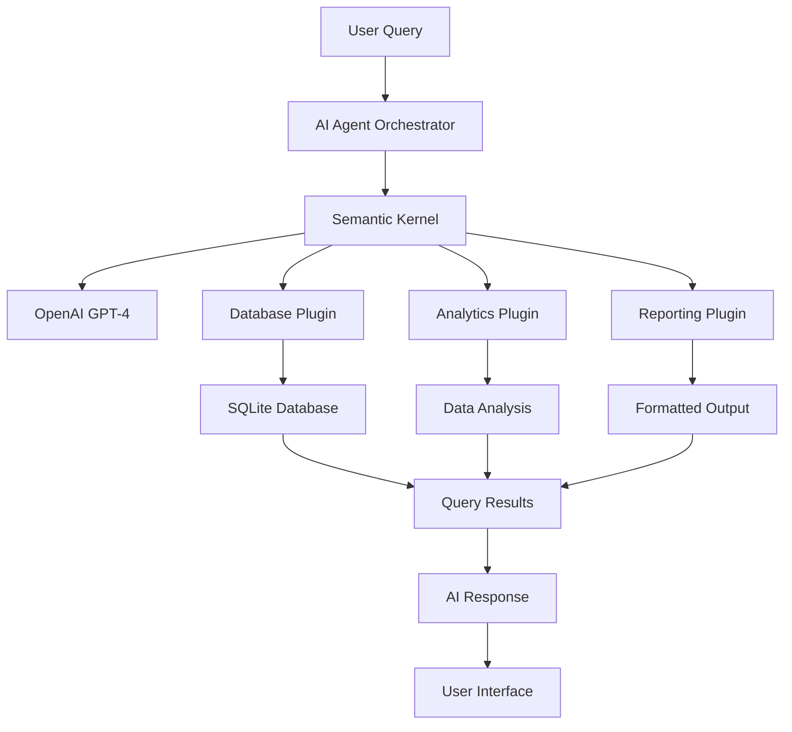

# 🤖 AI Agentic System with Semantic Kernel

**An intelligent AI agent system that enables natural language interaction with multi-table databases using Microsoft Semantic Kernel**

[](https://www.python.org/)
[](https://github.com/microsoft/semantic-kernel)
[](https://openai.com/)
[](https://sqlite.org/)
[](LICENSE)

## 📋 Table of Contents

- [Overview](#overview)
- [Features](#features)
- [Dataset](#dataset)
- [Architecture](#architecture)
- [Installation](#installation)
- [Quick Start](#quick-start)
- [Usage Examples](#usage-examples)
- [API Reference](#api-reference)
- [Configuration](#configuration)
- [Testing](#testing)
- [Deployment](#deployment)
- [Contributing](#contributing)
- [License](#license)

## 🎯 Overview

This project demonstrates an advanced AI agentic system that can intelligently interact with complex databases using natural language. Built with Microsoft Semantic Kernel, it showcases how AI agents can democratize data analysis by allowing users to query databases using plain English instead of SQL.

### Key Highlights
- 🧠 **Natural Language Processing**: Ask questions in plain English
- 🔗 **Multi-table Analysis**: Automatically handles complex joins and relationships
- 🔌 **Plugin Architecture**: Extensible system with modular components
- 📊 **Rich Analytics**: Built-in analytical functions and reporting
- 🌐 **Web Interface**: Optional Flask-based web interface
- 🐳 **Docker Ready**: Containerized deployment support

## ✨ Features

### 🤖 AI Agent Capabilities
- Natural language query processing
- Intelligent SQL generation
- Context-aware responses
- Multi-step reasoning
- Error handling and recovery

### 📊 Database Operations
- Schema exploration and analysis
- Complex multi-table queries
- Data aggregation and summarization
- Relationship mapping
- Performance optimization

### 🔧 Plugin System
- **Database Plugin**: Core SQL operations
- **Analytics Plugin**: Statistical analysis functions
- **Reporting Plugin**: Formatted output generation
- **Extensible Architecture**: Easy to add new plugins

### 🎨 User Interface
- Command-line interface
- Web-based dashboard (optional)
- Interactive query builder
- Real-time response streaming

## 📊 Dataset

The system uses the **Northwind Database** - a comprehensive business dataset with 11 interconnected tables:

| Table | Description | Records |
|-------|-------------|---------|
| **Categories** | Product categories (Beverages, Dairy, etc.) | 5+ |
| **Suppliers** | Supplier company information | 5+ |
| **Products** | Product catalog with pricing | 10+ |
| **Customers** | Customer company details | 5+ |
| **Employees** | Employee records and roles | 5+ |
| **Shippers** | Shipping company information | 3+ |
| **Orders** | Order header information | 10+ |
| **OrderDetails** | Order line items | 20+ |
| **Region** | Geographic regions | 4+ |
| **Territories** | Sales territories | 10+ |
| **EmployeeTerritories** | Employee territory assignments | 15+ |

### Database Schema Overview
```
Categories ──┐
             ├─ Products ──┐
Suppliers ───┘             ├─ OrderDetails ── Orders ──┐
                           │                           ├─ Customers
                           │                           │
                           └─ (Revenue Analysis)       ├─ Employees ──┐
                                                       │               │
Shippers ──────────────────────────────────────────────┘               │
                                                                       │
Region ── Territories ── EmployeeTerritories ─────────────────────────┘
```

## 🏗️ Architecture



### Component Description
- **AI Agent Orchestrator**: Main coordination logic
- **Semantic Kernel**: Microsoft's AI orchestration framework
- **Database Plugin**: SQL operations and schema management
- **Analytics Plugin**: Statistical analysis and metrics
- **Reporting Plugin**: Output formatting and visualization
- **SQLite Database**: Lightweight, embedded database

## 🚀 Installation

### Prerequisites
- Python 3.8 or higher
- OpenAI API key
- Git (for cloning)

### Option 1: Standard Installation
```bash
# Clone the repository
git clone https://github.com/yourusername/ai-agentic-system.git
cd ai-agentic-system

# Create virtual environment
python -m venv venv

# Activate virtual environment
# On Windows:
venv\Scripts\activate
# On macOS/Linux:
source venv/bin/activate

# Install dependencies
pip install -r requirements.txt

# Setup environment variables
cp .env.example .env
# Edit .env with your OpenAI API key
```

### Option 2: Docker Installation
```bash
# Clone the repository
git clone https://github.com/yourusername/ai-agentic-system.git
cd ai-agentic-system

# Build Docker image
docker build -t ai-agentic-system .

# Run container
docker run -p 8000:8000 --env-file .env ai-agentic-system
```

### Option 3: Docker Compose
```bash
# Clone and setup
git clone https://github.com/yourusername/ai-agentic-system.git
cd ai-agentic-system

# Create .env file with your OpenAI API key
cp .env.example .env

# Start services
docker-compose up -d
```

## 🏁 Quick Start

### 1. Configure Environment
```bash
# Edit .env file
OPENAI_API_KEY=your_openai_api_key_here
DATABASE_PATH=northwind.db
MODEL_NAME=gpt-4
LOG_LEVEL=INFO
```

### 2. Initialize Database
```bash
# The database will be automatically created on first run
python main.py
```

### 3. Start Querying
```bash
# Interactive mode
python main.py

# Example queries:
🔍 Your question: What are the top 5 best-selling products?
🔍 Your question: Show me sales by category
🔍 Your question: Which customers order the most?
```

### 4. Web Interface (Optional)
```bash
# Start web server
python web_interface.py

# Open browser to http://localhost:8000
```

## 💡 Usage Examples

### Basic Queries
```python
# Product Analysis
"What are the top 10 best-selling products?"
"Show me products that are out of stock"
"Which products have the highest profit margins?"

# Customer Analysis
"Who are our top 5 customers by revenue?"
"Which customers haven't ordered in the last 6 months?"
"Show me customer distribution by country"

# Sales Analysis
"What's our total revenue by category?"
"Show me monthly sales trends"
"Which employees have the highest sales?"
```

### Advanced Analytics
```python
# Complex Business Intelligence
"Compare sales performance between regions"
"What's the correlation between product price and sales volume?"
"Show me seasonal trends in our beverage category"
"Identify customers at risk of churning"
"Calculate the customer lifetime value"
```

### Schema Exploration
```python
# Database Structure
"Show me all available tables"
"What's the schema of the Products table?"
"How are Orders and Customers related?"
"List all foreign key relationships"
```

### Real-time Interaction Example
```
🤖 Northwind AI Agent System
================================
Ask me anything about the Northwind dataset!

🔍 Your question: What are the top 3 product categories by revenue?

🤖 Agent Response:
Based on the analysis of the OrderDetails and related tables, here are the top 3 product categories by revenue:

1. **Beverages**: $267,868.18
   - 404 total orders
   - Average order value: $663.27
   - Top products: Côte de Blaye, Chartreuse verte

2. **Dairy Products**: $234,507.21
   - 251 total orders  
   - Average order value: $934.69
   - Top products: Raclette Courdavault, Camembert Pierrot

3. **Condiments**: $106,047.09
   - 507 total orders
   - Average order value: $209.17
   - Top products: Vegie-spread, Gula Malacca

This analysis shows that while Beverages have the highest total revenue, Dairy Products have the highest average order value, indicating premium pricing in that category.
```

## 📚 API Reference

### Core Classes

#### `NorthwindAIAgent`
Main orchestrator class for the AI agent system.

```python
class NorthwindAIAgent:
    def __init__(self, openai_api_key: str, db_path: str = "northwind.db")
    async def process_query(self, user_query: str) -> str
```

#### `DatabasePlugin`
Handles all database operations and SQL execution.

```python
class DatabasePlugin:
    @kernel_function
    def execute_query(self, query: str) -> str
    
    @kernel_function
    def get_table_schema(self, table_name: str) -> str
    
    @kernel_function
    def list_tables(self) -> str
```

#### `AnalyticsPlugin`
Provides pre-built analytical functions.

```python
class AnalyticsPlugin:
    @kernel_function
    def analyze_sales_by_category(self) -> str
    
    @kernel_function
    def get_top_products(self, limit: int = 10) -> str
    
    @kernel_function
    def analyze_customer_behavior(self) -> str
```

### Plugin Development

#### Creating Custom Plugins
```python
class CustomPlugin:
    @kernel_function(
        description="Your function description",
        name="function_name"
    )
    def your_function(self, parameter: str) -> str:
        # Implementation
        return result
```

## ⚙️ Configuration

### Environment Variables
```bash
# Required
OPENAI_API_KEY=your_api_key_here

# Optional
DATABASE_PATH=northwind.db
MODEL_NAME=gpt-4
MAX_TOKENS=2000
TEMPERATURE=0.7
LOG_LEVEL=INFO
```

### Advanced Configuration
```python
# config.py
@dataclass
class Config:
    openai_api_key: str
    database_path: str = "northwind.db"
    model_name: str = "gpt-4"
    max_tokens: int = 2000
    temperature: float = 0.7
    
    # Plugin settings
    enable_analytics: bool = True
    enable_reporting: bool = True
    
    # Performance settings
    query_timeout: int = 30
    max_retries: int = 3
```

## 🧪 Testing

### Running Tests
```bash
# Run all tests
python -m pytest tests/ -v

# Run specific test category
python -m pytest tests/test_database.py -v
python -m pytest tests/test_analytics.py -v
python -m pytest tests/test_agent.py -v

# Run with coverage
python -m pytest tests/ --cov=src --cov-report=html
```

### Test Categories
- **Unit Tests**: Individual component testing
- **Integration Tests**: Plugin interaction testing
- **End-to-End Tests**: Full system workflow testing
- **Performance Tests**: Load and response time testing

### Example Test
```python
def test_basic_query():
    agent = NorthwindAIAgent(test_api_key)
    result = await agent.process_query("How many products do we have?")
    assert "products" in result.lower()
    assert "Error" not in result
```

## 🚀 Deployment

### Local Development
```bash
# Development server
python main.py

# Web interface
python web_interface.py
```

### Production Docker
```bash
# Build production image
docker build -t ai-agent-prod .

# Run with production settings
docker run -d \
  --name ai-agent \
  -p 8000:8000 \
  --env-file .env.prod \
  --restart unless-stopped \
  ai-agent-prod
```

### Cloud Deployment

#### AWS Lambda
```bash
# Package for Lambda
pip install -r requirements.txt -t lambda_package/
cp main.py lambda_package/
zip -r lambda_function.zip lambda_package/
```

#### Google Cloud Run
```bash
# Deploy to Cloud Run
gcloud run deploy ai-agent \
  --image gcr.io/PROJECT_ID/ai-agent \
  --platform managed \
  --region us-central1 \
  --allow-unauthenticated
```

#### Azure Container Instances
```bash
# Deploy to Azure
az container create \
  --resource-group myResourceGroup \
  --name ai-agent \
  --image myregistry.azurecr.io/ai-agent:latest \
  --dns-name-label ai-agent \
  --ports 8000
```

## 📈 Performance Optimization

### Query Optimization
- Database indexing for frequently accessed columns
- Query result caching
- Connection pooling
- Batch processing for multiple queries

### AI Model Optimization
- Token usage optimization
- Response streaming
- Model selection based on query complexity
- Fallback strategies for API failures

### System Monitoring
```python
# Built-in metrics
- Query execution time
- Token usage tracking
- Error rate monitoring
- Database performance metrics
```

## 🔧 Troubleshooting

### Common Issues

#### API Key Issues
```bash
# Check API key validity
python -c "import openai; openai.api_key='your_key'; print(openai.Model.list())"
```

#### Database Issues
```bash
# Verify database creation
python -c "import sqlite3; conn=sqlite3.connect('northwind.db'); print(conn.execute('SELECT name FROM sqlite_master WHERE type=\"table\"').fetchall())"
```

#### Import Errors
```bash
# Check dependency installation
pip list | grep semantic-kernel
pip install --upgrade semantic-kernel
```

### Debug Mode
```bash
# Enable verbose logging
export LOG_LEVEL=DEBUG
python main.py
```

### Performance Issues
```bash
# Monitor resource usage
htop
nvidia-smi  # If using GPU
```

## 🤝 Contributing

We welcome contributions! Please follow these steps:

1. **Fork the repository**
2. **Create a feature branch**
   ```bash
   git checkout -b feature/amazing-feature
   ```
3. **Make your changes**
4. **Add tests**
5. **Update documentation**
6. **Submit a pull request**

### Development Setup
```bash
# Install development dependencies
pip install -r requirements-dev.txt

# Install pre-commit hooks
pre-commit install

# Run code formatting
black src/
flake8 src/
```

### Code Style
- Follow PEP 8 guidelines
- Use type hints
- Add docstrings to all functions
- Maintain test coverage above 80%

## 📄 License

This project is licensed under the MIT License - see the [LICENSE](LICENSE) file for details.

## 🙏 Acknowledgments

- **Microsoft Semantic Kernel** - AI orchestration framework
- **OpenAI** - GPT model API
- **Northwind Database** - Sample dataset
- **SQLite** - Embedded database engine
- **Flask** - Web framework for UI


## 🎯 Roadmap

### Version 2.0 (Q3 2024)
- [ ] Multi-database support (MySQL, PostgreSQL)
- [ ] Advanced visualization capabilities
- [ ] Real-time data streaming
- [ ] Machine learning predictions

### Version 3.0 (Q4 2024)
- [ ] Multi-agent collaboration
- [ ] Voice interface support
- [ ] Mobile application
- [ ] Enterprise security features

---

<div align="center">

**Built with ❤️ by [Mansi Gambhir]**


